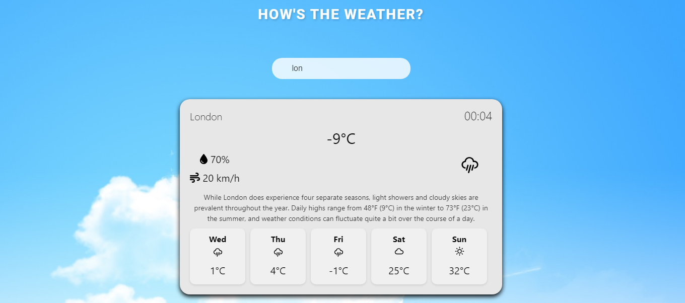

# Weather Dashboard App

Welcome to the Weather Dashboard app! This application provides weather data for cities around the world. With a sleek and intuitive user interface, you can easily search for cities and access detailed weather information at your fingertips.

## Introduction

The Weather Dashboard app is built with React.js for the frontend and Node.js for the backend. It leverages a JSON file containing mock weather data for demonstration purposes Further for more detailed information of weather we have configured API using node JS. The frontend communicates with the backend API to fetch weather data based on user input.The frontend application automatically updates results when the user starts typing in the input field "citySearch" with at least 2 letters.

## Features

- **City Search:** Seamlessly search for cities by typing in the search bar. The application suggests city names based on your input, making it easy to find the desired location.

- **Detailed Weather Information:** View detailed weather information for the selected city, including current weather conditions and a 5-day weather forecast. The application displays weather descriptions and predictions, helping you plan your activities accordingly.

- **Interactive UI:** Experience an interactive user interface that allows you to expand weather cards for more details. Each card provides comprehensive weather data, making it easy to stay informed about the weather conditions.

## Preview

### Step 1: Dashboard View


This is the main dashboard view of the Weather Dashboard application. Here, you can see the search bar where you can input the city name to fetch weather data.

### Step 2: Searching for a City


When you start typing in the search bar, the application suggests city names based on your input. In this screenshot, the user is searching for "Lon" and the application suggests "London". Once the user selects a city, the weather data for that city is fetched from the JSON file.

### Step 3: Expanded Card View



After selecting a city, click on the weather card it expands to show more details. Here, you can see the weather description and the weather forecast for the next 5 days. This information is fetched from the backend API endpoint `localhost:4000/weather?city={cityName}`.

## Getting Started

To run the application locally using Docker Compose, follow these steps:

### Prerequisites

- Docker Desktop: [Download](https://www.docker.com/products/docker-desktop)

### Clone the Repository

Clone the repository to your local machine:

```bash
git clone https://github.com/your-username/weather-dashboard.git
cd weather-dashboard (Open terminal or VScode or powershell)


### Starting Docker Containers:

docker-compose up -d

### Check the output:

 http://localhost:3000

### List of cities for search:

    NewJersey
    NewYork
    London
    Mumbai
    LosAngeles

```
### Additional Information:
When you click on a weather card in the dashboard view, it expands to show more detailed information about the weather for that particular city. This detailed view includes the weather description and a 5-day weather forecast, providing users with comprehensive insights into the weather conditions. This information is fetched from the backend API endpoint `localhost:4000/weather?city={cityName}`.
The mock weather data is fetched from the endpoint http://localhost:3000/weatherdata.json.
The Weather data with specific city is fetched by this endpoint http://localhost:4000/weather?city={cityname}

## Automated Testing with Coverage

The Weather Dashboard app includes comprehensive automated testing to ensure reliability and maintainability. We have implemented unit tests and integration tests for both the frontend and backend components of the application. Additionally, we utilize code coverage tools to measure the effectiveness of our test suite.
Test Coverage
After running the tests, you can view the test coverage reports to assess the effectiveness of our test suite. The coverage reports provide insights into which parts of the codebase are covered by tests and identify areas that may require additional testing.

The coverage reports for frontend are generated in the coverage directory of their respective directories. Open the HTML coverage report in your web browser to view detailed coverage statistics.

### Frontend Testing

The frontend tests are written using the Jest testing framework along with React Testing Library for rendering components and simulating user interactions. These tests cover various scenarios, including component rendering, user interactions, and state management.

To run frontend tests and generate coverage reports, use the following command:

```bash
npm test -- --coverage
```

Note :⚠️ Please note that the Docker may take some time to build, especially if you're running Docker for the first time or if you have a slow internet connection. Additionally, there is room for further improvement in the application UI and features. If I had more time, I would have enhanced the user interface and could add more features to make the Weather Dashboard app even better.


